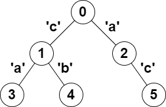

---
## 位运算 + dfs

## [LeetCode 2791. 树中可以形成回文的路径数](https://leetcode.cn/problems/count-paths-that-can-form-a-palindrome-in-a-tree/)

<font color=red>困难</font>

给你一棵 树（即，一个连通、无向且无环的图），根 节点为 `0` ，由编号从 `0` 到 `n - 1` 的 `n` 个节点组成。

这棵树用一个长度为 `n` 、下标从 `0` 开始的数组 `parent` 表示，其中 `parent[i]` 为节点 `i` 的父节点，由于

节点 `0` 为根节点，所以 `parent[0] == -1` 。另给你一个长度为 `n` 的字符串 `s` ，其中 `s[i]` 是分配给 `i` 

和 `parent[i]` 之间的边的字符。`s[0]` 可以忽略。找出满足 `u < v` ，且从 `u` 到 `v` 的路径上分配的字符可

以 重新排列 形成 回文 的所有节点对 `(u, v)` ，并返回节点对的数目。如果一个字符串正着读和反着读都相

同，那么这个字符串就是一个 回文 。

### 示例 1：

```
输入：parent = [-1,0,0,1,1,2], s = "acaabc"
输出：8
解释：符合题目要求的节点对分别是：
- (0,1)、(0,2)、(1,3)、(1,4) 和 (2,5) ，路径上只有一个字符，满足回文定义。
- (2,3)，路径上字符形成的字符串是 "aca" ，满足回文定义。
- (1,5)，路径上字符形成的字符串是 "cac" ，满足回文定义。
- (3,5)，路径上字符形成的字符串是 "acac" ，可以重排形成回文 "acca" 。
```
### 示例 2：
```
输入：parent = [-1,0,0,0,0], s = "aaaaa"
输出：10
解释：任何满足 u < v 的节点对 (u,v) 都符合题目要求。
```
### 提示：

+ n == parent.length == s.length
+ 1 <= n <= 10^5
+ 对于所有 i >= 1 ，0 <= parent[i] <= n - 1 均成立
+ parent[0] == -1
+ parent 表示一棵有效的树
+ s 仅由小写英文字母组成

```python
'''
1. 从 u 到 v 的路径上分配的字符可以 重新排列 形成 回文
=> 至多一个字母出现奇数次，其余字母出现偶数次

2. 偶数次用 0 表示，奇数次用 1 表示
=> 用长为 26 的 bool 数组 => 用一个 int 表示

3. 用异或来处理字母出现的奇偶性
   计算的是从根到某个点的路径上的边异或值
   从 lca 到 b 的异或 = 根到 b 的异或值 ^ 根到 lca 的异或值

XOR_a = 根到 a 的异或值
4. 根到 b 的异或值 ^ 根到 lca 的异或值 = XOR_a ^ XOR_b

5. 问题变成 XOR_a ^ XOR_b = 0 或者 1 << i  i 取 0 ~ 25

用一次 DFS 求出所有的 XOR_a
6. 问题变成，给你一个长度为 n-1 的数组
有多少个“两数异或”是 0，是 1 << 0，是 1 << 1 ... 1 << 25

7. 如果单独一个数 XOR_a 就已经满足要求了，那么可以让它异或 0，转换成两数异或的情况（异或的是一条空路径）
'''
class Solution:
    def countPalindromePaths(self, parent: List[int], s: str) -> int:
        n = len(s)
        g = [[] for _ in range(n)]
        for i in range(1, n):
            bit = 1 << (ord(s[i]) - ord('a')) # s[i] - 'a'
            g[parent[i]].append((i, bit))
        # 时间复杂度: O(26n)
        ans = 0
        cnt = Counter()
        def dfs(v: int, xor: int) -> None:
            nonlocal ans
            ans += cnt[xor] # xor ^ xor = 0
            for i in range(26):
                ans += cnt[xor ^ (1 << i)] # xor ^ (xor ^ (1 << i)) = 1 << i
            cnt[xor] += 1
            for to, wt in g[v]:
                dfs(to, xor ^ wt)
        dfs(0, 0) # cnt[0] -> 单个字符也是回文串
        return ans
```
---
```cpp
typedef pair<int, int> PII;

class Solution {
public:
    vector<vector<PII>> g;
    long long ans;
    unordered_map<int, int> cnt;

    void dfs(int v, int xorr) {
        ans += cnt[xorr];
        for (int i = 0; i < 26 ; i ++ )
            ans += cnt[xorr ^ (1 << i)];
        cnt[xorr] += 1;
        for (auto &[to, wt]: g[v])
            dfs(to, xorr ^ wt);
    }

    long long countPalindromePaths(vector<int>& parent, string s) {
        int n = s.size();
        g.resize(n);
        for (int i = 1; i < n ; i ++ ) {
            int bit = 1 << (s[i] - 'a');
            g[parent[i]].push_back({i, bit});
        }
        dfs(0, 0);
        return ans;
    }
};
```